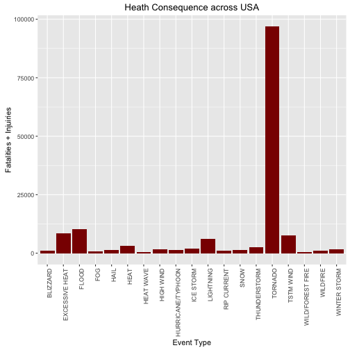
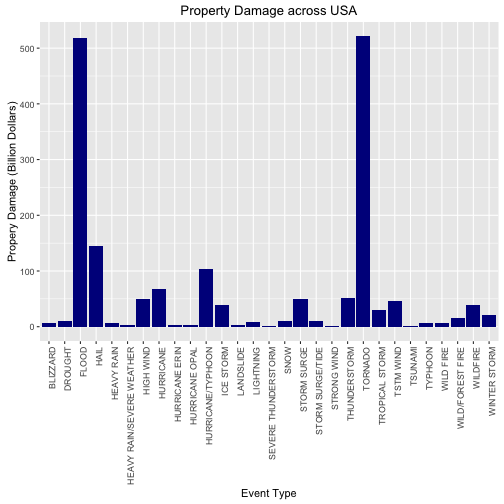
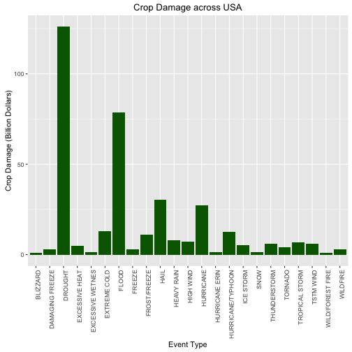

Effects of Weather on US Health and Economy
==============================================


### Synopsis

In this study, effects of various weather events across USA was studied. In particular, health effects (injuries and fatalities) and economic consequence (property and crop damage) were studied. Data from U.S. National Oceanic and Atmospheric Administration's (NOAA) storm database was used. It was found that

* Health Consequence
    * Tornado causes more injuries and fatalities
* Economic Consequence
    * Flood and Tornado causes more property damage
    * Drought causes more crop damage

# 1. Data Processing
In this section, we describe the source from where we got the data and also the preprocessing steps that we performed.

## a. Reading the data 

Data is from the U.S. National Oceanic and Atmospheric Administration's (NOAA) storm database. It was provided by coursera as part of the assignmenet for the course 'Reproducable Research'. This database tracks characteristics of major storms and weather events in the United States, including when and where they occur, as well as estimates of any fatalities, injuries, and property damage.

Data is in the form of compressed csv file which was first read in.


```r
mydata <- read.csv("~/Desktop/repdata-data-StormData.csv.bz2")
```

## b. Preprocessing

Once the data is read, following steps were followed to end up with a clean data. First step is to clean up the event types. 


```r
event_levels <- length(levels(mydata$EVTYPE))
```

As it can be seen, it has around **985** levels. Most of them are redundant.

First, even types were made case insensitive by stripping the white spaces and converting them to upper case,


```r
mydata$EVTYPE_modified <- as.factor(trimws(toupper(mydata$EVTYPE)))
```

Then records (rows) which had 'summary' in its value were removed. They don't really indicate an event type


```r
mydata <- mydata %>% filter(!grepl('SUMMARY',EVTYPE_modified))
```

then plurals to singular by removing 'S' at the end of a word.


```r
mydata$EVTYPE_modified <- as.factor( gsub("S$", "", mydata$EVTYPE_modified, perl=TRUE) )
```

Then misspelled words and similar event types were grouped together by substituing them with the right event types


```r
#Group Thunderstorm events together
mydata$EVTYPE_modified <- as.factor( gsub("^THUN.*STORM.*$", "THUNDERSTORM", mydata$EVTYPE_modified, perl=TRUE) )
#Group Thunderstorm winds together
mydata$EVTYPE_modified <- as.factor( gsub("^TSTM WIND.*$", "TSTM WIND", mydata$EVTYPE_modified, perl=TRUE) )
#Group snow events together
mydata$EVTYPE_modified <- as.factor( gsub("^.*SNOW.*$", "SNOW", mydata$EVTYPE_modified, perl=TRUE) )
#Group hail events together
mydata$EVTYPE_modified <- as.factor( gsub("^.*HAIL.*$", "HAIL", mydata$EVTYPE_modified, perl=TRUE) )
#Group flood events together
mydata$EVTYPE_modified <- as.factor( gsub("^.*FLOOD.*$", "FLOOD", mydata$EVTYPE_modified, perl=TRUE) )
#Group high wind events together
mydata$EVTYPE_modified <- as.factor( gsub("^.*HIGH.*WIND.*$", "HIGH WIND", mydata$EVTYPE_modified, perl=TRUE) )
#Group heavy rain events together
mydata$EVTYPE_modified <- as.factor( gsub("^.*HEAVY.*RAIN$", "HEAVY RAIN", mydata$EVTYPE_modified, perl=TRUE) )
#Group water spout together
mydata$EVTYPE_modified <- as.factor( gsub("^.*WATER.*SPOUT.*$", "WATERSPOUT", mydata$EVTYPE_modified, perl=TRUE) )
#Group Tornado together
mydata$EVTYPE_modified <- as.factor( gsub("^.*TORNADO.*$", "TORNADO", mydata$EVTYPE_modified, perl=TRUE) )
```


```r
#Get the number of event types
event_levels <- length(levels(mydata$EVTYPE_modified))
```


Now the number of events have reduced to **396**

## c. Health Consequence

To determine health damage, injuries and fatlalities were summed up


```r
mydata <- mydata %>% mutate(HEALTH_DMG = FATALITIES + INJURIES)
```

## d. Economic Consequence

To determine economic consequence, property and crop damage were evaluated. 

The fields **PROPDMGEXP** and **CROPDMGEXP** were transformed to act as multipliers for the fields **PROPDMG** and **CROPDMG** respectively.

For e.g if a record has '25' in **PROPDMG** and 'K' in **PROPDMGEXP**, then total damage is 25K or 25,000. In order to do that replacing K in **PROPDMGEXP** with 1000 and then multiplying these 2 columns will give the actual damage of 25,000. Similar logic applies to **CROPDMG** and **CROPDMGEXP**. To transform following steps were followed

1. Trim the white space
2. Convert all to uppper case
3. Replace fields which are not H, K, M or B with 1.0
3. Replace 'H' with 100, 'K' with 1000, 'M' with million and 'B' with billion

For property damage,


```r
#trim white space and convert it to upper case
mydata$PROPDMGEXP <- trimws(toupper(mydata$PROPDMGEXP))

#Replace values which are K, H, M or B with 1
mydata[!grepl('K|H|M|B',mydata$PROPDMGEXP, perl=TRUE),'PROPDMGEXP'] <- 1.0

#Replace values which are H with 100
mydata[grepl('H',mydata$PROPDMGEXP, perl=TRUE),'PROPDMGEXP'] <- 100
#Replace values which are K with 1000
mydata[grepl('K',mydata$PROPDMGEXP, perl=TRUE),'PROPDMGEXP'] <- 1000
#Replace values which are M with 1e6
mydata[grepl('M',mydata$PROPDMGEXP, perl=TRUE),'PROPDMGEXP'] <- 1e6
#Replace values which are B with 1e8
mydata[grepl('B',mydata$PROPDMGEXP, perl=TRUE),'PROPDMGEXP'] <- 1e8

#Now multiply the cols to get the actual damage
mydata$PROP_DMG_DOLLARS <- mydata$PROPDMG * as.numeric(mydata$PROPDMGEXP)
```

Similarly for crop damage,


```r
#trim white space and convert it to upper case
mydata$CROPDMGEXP <- trimws(toupper(mydata$CROPDMGEXP))

#Replace values which are K, H, M or B with 1
mydata[!grepl('K|H|M|B',mydata$CROPDMGEXP, perl=TRUE),'CROPDMGEXP'] <- 1.0
#Replace values which are H with 100
mydata[grepl('H',mydata$CROPDMGEXP, perl=TRUE),'CROPDMGEXP'] <- 100
#Replace values which are K with 1000
mydata[grepl('K',mydata$CROPDMGEXP, perl=TRUE),'CROPDMGEXP'] <- 1000
#Replace values which are M with 1e6
mydata[grepl('M',mydata$CROPDMGEXP, perl=TRUE),'CROPDMGEXP'] <- 1e6
#Replace values which are B with 1e8
mydata[grepl('B',mydata$CROPDMGEXP, perl=TRUE),'CROPDMGEXP'] <- 1e8

#Now multiply the cols to get the actual damage
mydata$CROP_DMG_DOLLARS <- mydata$CROPDMG * as.numeric(mydata$CROPDMGEXP)
```


# 2. Results

The clean data is grouped by event type and total damage for each event type is computed. 

```r
storm_summary <- mydata %>% 
    group_by(EVTYPE_modified) %>%
    summarize(
        TOTAL_HEALTH_DMG = sum(HEALTH_DMG),
        TOTAL_CROP_DMG   = sum(CROP_DMG_DOLLARS),
        TOTAL_PROP_DMG   = sum(PROP_DMG_DOLLARS)
    )
```

Now to the plots,

## a. Health Consequence Plot

For clarity, results were plotted for data which has *TOTAL_HEALTH_DMG* > 500


```r
ggplot(storm_summary %>% filter(TOTAL_HEALTH_DMG > 500),
       aes(x=EVTYPE_modified,y=TOTAL_HEALTH_DMG)) + 
    geom_bar(stat="identity",position="dodge", fill="darkred") + 
    theme(axis.text.x = element_text(angle = 90, hjust = 1)) +
    labs(x="Event Type", y="Fatalities + Injuiries") +
    ggtitle("Heath Consequence across USA")
```

 

## b. Property Damage Plot

For clarity, results were plotted for data which has *TOTAL_PROP_DMG* greater than 1 billion dollars


```r
ggplot(storm_summary %>% filter(TOTAL_PROP_DMG > 1e8), 
       aes(x=EVTYPE_modified,y=TOTAL_PROP_DMG/1e8)) + 
    geom_bar(stat="identity",position="dodge", fill="darkblue") +
    theme(axis.text.x = element_text(angle = 90, hjust = 1)) +
    labs(x="Event Type", y="Propery Damage (Billion Dollars)") +
    ggtitle("Property Damage across USA")
```

 

## c. Crop Damage Plot

For clarity, results were plotted for data which has *TOTAL_CROP_DMG* greater than 1 billion dollars


```r
ggplot(storm_summary %>% filter(TOTAL_CROP_DMG > 1e8), 
       aes(x=EVTYPE_modified,y=TOTAL_CROP_DMG/1e8)) + 
    geom_bar(stat="identity",position="dodge", fill="darkgreen") + 
    theme(axis.text.x = element_text(angle = 90, hjust = 1)) +
    labs(x="Event Type", y="Crop Damage (Billion Dollars)") +
    ggtitle("Crop Damage across USA")
```

 

# 3. Conclusion

From the plots, it is clear that **Tornado** causes more injuries and fatalities, both **Flood and Tornado** causes more property damage and **Drought** causes more crop damage.


